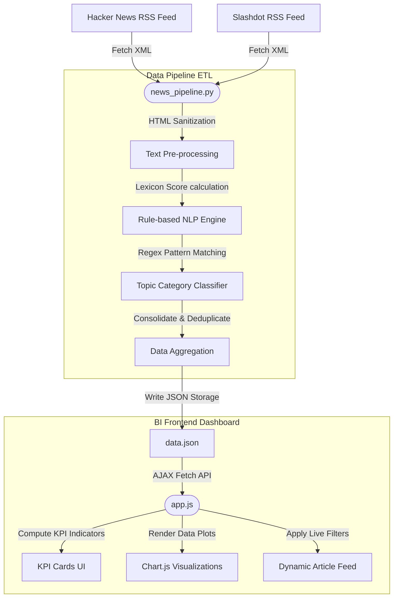

# ApexTech News Analytics: Sentiment & BI Dashboard

A professional-grade **Data Engineering & Business Intelligence (BI) Dashboard** designed to ingest, process, and analyze technology news stories from live RSS feeds. The platform applies rule-based Natural Language Processing (NLP) to calculate sentiment scores and projects interactive analytics through a beautiful, glassmorphic dark-theme interface.

This codebase is created to showcase full-stack data capabilities, aligning with skills in **Python Data Engineering, ETL Pipeline Design, Text Mining/Sentiment Analysis, and BI Dashboard Development**.

---

## 📊 System Architecture

The following diagram outlines the end-to-end data pipeline, demonstrating how news flows from live XML feeds, through the Python NLP processor, and into the visual frontend:



---

## 🛠️ Technology Stack & Design Decisions

### Data Backend (ETL)
*   **Language**: Python 3 (Zero external package dependencies for maximum portability).
*   **Libraries**: 
    *   `xml.etree.ElementTree` for fast RSS XML parsing.
    *   `urllib.request` for fetching live feeds over HTTPS with custom User-Agent headers.
    *   `re` for text cleaning and regex-based category classification.
*   **Database**: JSON-based flat-file storage (`data.json`) acting as a lightweight, lightning-fast data cache.

### Analytics & BI Frontend
*   **Structure**: Semantic HTML5 containing native layout nodes.
*   **Styling**: Vanilla CSS3 implementing a high-end Glassmorphism theme (semi-transparent card backgrounds, backdrop blur filters, custom glow-effects, custom checkboxes, and custom select fields).
*   **Interactions**: Vanilla ES6 JavaScript for AJAX queries, filter bindings, sorting states, and KPI calculations.
*   **Charts**: Animated responsive graphs powered by **Chart.js** via CDN.
*   **Icons**: FontAwesome v6 CDN.

---

## 📂 Codebase Reference

*   [news_pipeline.py]: Orchestrates RSS feed fetching, data scrubbing, tag mapping, sentiment calculations, and storage updates.
*   [data.json]: Cache containing all parsed articles and analytical labels.
*   [index.html]: Layout structure for the visual BI Dashboard.
*   [styles.css]: Complete styling sheets defining CSS variables, grids, and transitions.
*   [app.js]: Controller logic managing state filters, metrics compilation, and dynamic plot rendering.

---

## 📈 Analytics & NLP Logic

### Sentiment Scoring Formula
The sentiment scoring logic uses a lexicon of positive and negative words. For any article, we scan the combined title and description fields to count matching terms:

\[\text{Sentiment Score} = \frac{\text{Positive Match Count} - \text{Negative Match Count}}{\text{Positive Match Count} + \text{Negative Match Count}}\]

*   **Score Bounds**: Normalized strictly within `[-1.00, +1.00]`.
*   **Threshold Classifications**:
    *   **Positive**: `Score > 0.15` (indicated with Emerald Green borders)
    *   **Negative**: `Score < -0.15` (indicated with Crimson Red borders)
    *   **Neutral**: `[-0.15, +0.15]` (indicated with Slate Grey borders)

### Tag Classification (Taxonomy)
Articles are automatically tagged with technology stacks based on regex search patterns:
*   `AI/ML`: Triggers on terms like `AI`, `ML`, `LLM`, `GPT`, `DeepMind`, `neural`, `learning`.
*   `Python`: Triggers on `python`, `django`, `flask`, `pandas`, `numpy`, `fastapi`, `pip`.
*   `Web Dev`: Triggers on `javascript`, `react`, `next.js`, `node`, `css`, `frontend`.
*   `Cloud`: Triggers on `aws`, `azure`, `gcp`, `kubernetes`, `docker`, `cloud`.
*   `Big Data`: Triggers on `spark`, `hadoop`, `kafka`, `lakehouse`, `databricks`, `analytics`.
*   `Database`: Triggers on `sql`, `postgres`, `mongodb`, `database`, `redis`.
*   `Security`: Triggers on `security`, `cyber`, `encryption`, `vulnerability`, `exploit`, `hacker`.

---

## 🚀 Installation & Running Guide

Ensure Python 3 is installed on your local environment.

### 1. Ingest Latest Data (Run Python Pipeline)
To fetch live news items, analyze their content, and refresh the database cache:

```bash
# Navigate to the project root directory
cd C:\Users\kadam\.gemini\antigravity\scratch\tech-news-analytics

# Execute the python ETL script
python news_pipeline.py
```

You should see log output detailing fetched quantities:
```text
Starting news pipeline ingestion...
Fetching RSS feed from HackerNews...
Ingested 30 articles from HackerNews.
Fetching RSS feed from Slashdot...
Ingested 15 articles from Slashdot.
Loaded 45 existing articles from data.json.
Pipeline executed successfully. Total articles in storage: 60.
```

### 2. Launch the BI Dashboard
To serve the frontend dashboard locally:

```bash
# Start a lightweight Python web server on port 8000
python -m http.server 8000
```

Open your browser and navigate to:
[http://localhost:8000](http://localhost:8000)

---

## 💼 Portfolio Highlights for Career Presentation

When presenting this project to hiring managers or teams:
1.  **ETL Ingestion & Robust Handling**: Point out that the pipeline parses raw XML from external feeds, cleans tags gracefully, handles offline failures using database fallback caches, and deduplicates records.
2.  **Modular Architecture**: Show how data creation (Python backend) is decoupled from data consumption (JSON + JavaScript Frontend).
3.  **Modern UI/UX**: Demonstrate the use of responsive layout structures, smooth CSS micro-animations, color-coded KPI indicators, and interactive charts displaying instant filtering logic.
